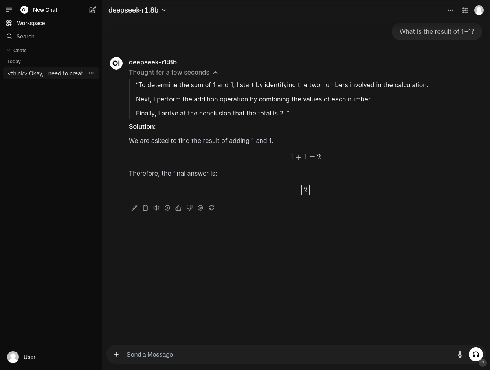

# Ollama with docker

Simple example of how to use local LLMs with [Ollama](https://ollama.com) and [Docker](https://docker.com).

To interact with the models we use [Open WebUI](https://github.com/open-webui/open-webui).

## System requirements

* **Linux based operating system** (tested in Ubuntu 24.04)
* **Nvidia GPU with at least 8 GB of VRAM** (tested in NVIDIA GeForce RTX 2070 8GB)

## First steps

1. [Install Docker Engine](https://docs.docker.com/engine/install)
1. [Install Nvidia drivers](https://docs.nvidia.com/cuda/cuda-installation-guide-linux)
1. [Install Nvidia container toolkit](https://docs.nvidia.com/datacenter/cloud-native/container-toolkit/latest/install-guide.html)

## Model deployment

We can deploy Ollama and Open WebUI with [docker compose](https://docs.docker.com/compose):

```bash
docker compose --profile gpu up -d
```

When the system is deployed for the first time, we need to download the model in Ollama. We can use the [curl](https://curl.se) command line tool in order to call the Ollama API and download the desired model. In the next command we have downloaded the [DeepSeek-R1](https://api-docs.deepseek.com/news/news250120) model (`deepseek-r1:8b`). We can see all Ollama available models in https://ollama.com/search.

```bash
curl -X POST http://127.0.0.1:11434/api/pull -d '{"name": "deepseek-r1:8b"}'
```

## Usage

After initialization, to use the model we can go to the URL http://127.0.0.1:8080 in the web browser.


